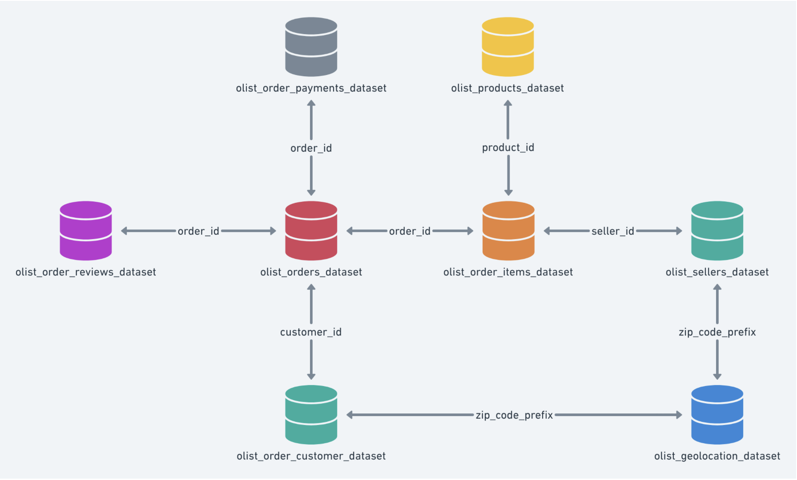

# 🛒 Brazilian E-Commerce (MySQL Project)

## 📌 Project Overview

This project is built using the **Brazilian E-Commerce Public Dataset by Olist**, available on [Kaggle](https://www.kaggle.com/datasets/olistbr/brazilian-ecommerce/data).

---

## 📁 Dataset Source

**Kaggle URL:**  
https://www.kaggle.com/datasets/olistbr/brazilian-ecommerce/data

The dataset was provided by [Olist](https://www.olist.com/), a large Brazilian marketplace platform. It includes real-world e-commerce data such as customers, orders, products, payments, reviews, and more.

---

## 🧠 What This Project Includes(goals)

- 🔍 **Exploratory_Data_Analysis**  
		Basic exploration of the dataset by counting total entities, product distributions, customer feedback scores, and identifying the top 10 sellers by order volume.
- 🔗 **Joins_and_Subqueries**  
		Insights using joins and subqueries to view order details with customer/seller/product info, detect single-order customers, find the priciest products per category, and calculate average review scores per seller.

- 🪟 **Window_Functions**  
		Ranked sellers monthly, tracked returning customers, calculated cumulative daily orders, and measured delivery times.

- 💰 **Revenue_Orders_Delivery**  
 		Done Analysis for covering delivery efficiency, cancellation trends, delayed shipments, regional revenue, customer order frequency, and category-wise revenue generation.


---

## 🧩 Tables Used

The following tables were created and populated from CSV files:

| Table Name                         | Description |
|------------------------------------|-------------|
| `customers`                        | Customer data with zip code and location |
| `orders`                           | Order data, order status, and timestamps |
| `order_items`                      | Product-level items for each order |
| `order_payments`                   | Payment info for each order |
| `order_reviews`                    | Reviews and ratings by customers |
| `products`                         | Product details like category and dimensions |
| `sellers`                          | Seller data and location |
| `geolocation`                      | Latitude and longitude for zip codes |
| `product_category_name_translation` | Translation of product category names |

---

## 🗂️ Files Included

- `Exploratory_Data_Analysis.sql`
- `Joins_and_Subqueries.sql`
- `Window_Functions.sql`
- `Revenue_Orders_Delivery.sql
- `olist_tables_relation.png` — ER diagram showing how the tables are related
- `README.md` — Project description and documentation

---

## 🔗 ER Diagram

>   
> *(Replace this with the actual diagram image filename if needed)*


---

## 🛠️ How to Use This Project

### 1. 📥 Download the Data

1. Create a Kaggle account (if you don't have one).
2. Go to the [dataset link](https://www.kaggle.com/datasets/olistbr/brazilian-ecommerce/data).
3. Click **Download All** to get a `.zip` file.
4. Extract all `.csv` files.

### 2. 🗃️ Import to MySQL

1. Open **MySQL Workbench**.
2. Create a **new schema** called `brazilian-olist` (or any name you prefer).
3. Import the `.csv` files into MySQL:
   - You can use **Table Data Import Wizard** in Workbench (Right-click on Tables → "Table Data Import Wizard").
   - Map columns and define datatypes as needed.

### 3. 🧠 Run SQL Analysis

1. Open above mentioned `.sql` files.
2. Make sure your active schema is selected (e.g., `USE brazilian-olist;`).
3. Execute the SQL script to run the analysis queries.

### 🔍 Example Query
```sql
SELECT
  c.customer_state,
  COUNT(DISTINCT o.order_id) AS total_orders
FROM
  customers c
  JOIN orders o ON c.customer_id = o.customer_id
GROUP BY
  c.customer_state
ORDER BY
  total_orders DESC;
