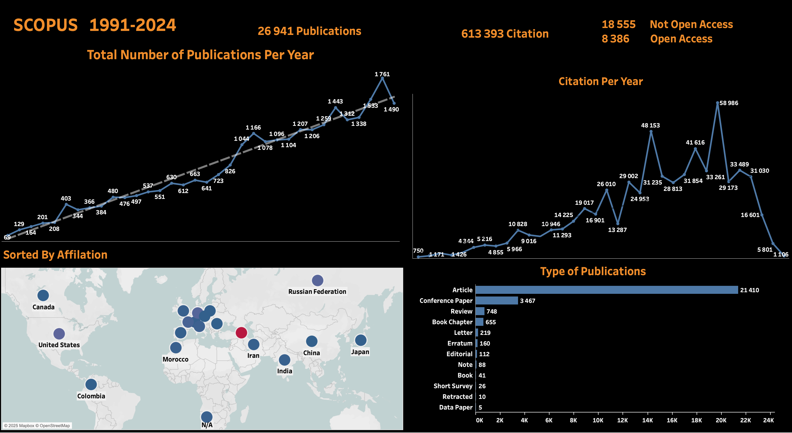

# Scopus Data Analysis Dashboard

## Overview
This project analyzes academic publication data from Scopus (1991-2024) to visualize research trends, citation patterns, and collaboration networks for. The dashboard provides comprehensive insights into publication metrics with a focus on Armenian research output.

## Data Collection
- Utilized the Scopus API to retrieve publication data spanning from 1991 to 2024
- Implemented Python scripts to collect data in specified year ranges
- Retrieved key publication metadata including:
  * Publication dates
  * Author information
  * Institutional affiliations
  * Citation counts
  * Document types
  * Open access status

## Dashboard Components
>   
> *(Replace this with the actual diagram image filename if needed)*

### Key Metrics
* **Total Publications**: 26,941 publications analyzed
* **Total Citations**: 613,393 citations tracked
* **Open Access Status**: 
  * 8,386 Open Access publications
  * 18,555 Non-Open Access publications

### Visualizations

#### Publication Trends
A line graph showing the total number of publications per year from 1991 to 2024, highlighting:
* Steady growth from ~100 publications in early 1990s
* Sharp increase after 2005
* Peak of 1,761 publications (highest annual output)
* Recent trends maintaining above 1,000 publications annually

#### Citation Analysis
A time-series visualization of citation counts per year with:
* Peak citation count of 58,986 in a single year
* Multiple years exceeding 30,000 citations
* Comprehensive citation trajectory over the entire period

#### Publication Types
Horizontal bar chart displaying document type distribution:
* Articles: 21,410 (dominant publication type)
* Conference Papers: 3,467
* Reviews: 748
* Book Chapters: 655
* Other types: Letters, Errata, Editorials, Notes, Books, Surveys, etc.

#### Geographical Collaboration
World map visualization showing international research collaborations with:
* Major research partnerships with Russian Federation, United States, China, Japan
* Additional collaborations with Canada, India, Iran, Morocco, Colombia
* Bubble size indicating collaboration intensity

## Technical Implementation
* **Data Collection**: Python script using Requests library to interact with Scopus API
* **Data Processing**: Pandas for data structuring and manipulation
* **Visualization**: Tableau for creating interactive dashboard components
* **Data Storage**: CSV format for portability and integration

## Current Status
* Functional dashboard with comprehensive publication metrics
* Interactive visualizations for trends analysis
* Geographic mapping of research collaborations

## Future Enhancements
* Add filtering capabilities for more detailed analysis
* Improve user interface for better interactivity
* Implement additional metrics for research impact analysis
* Create author-specific analysis views
* Add subject area classification visualization

## Tools Used
* Python 3.9
* Scopus API
* Pandas library
* Requests library
* Tableau

## Tableau Public of the project
Dashboard avaliable in [Tableau Public](https://public.tableau.com/views/scopus_publications_dashboard/Dashboard1?:language=en-GB&publish=yes&:sid=&:redirect=auth&:display_count=n&:origin=viz_share_link). 